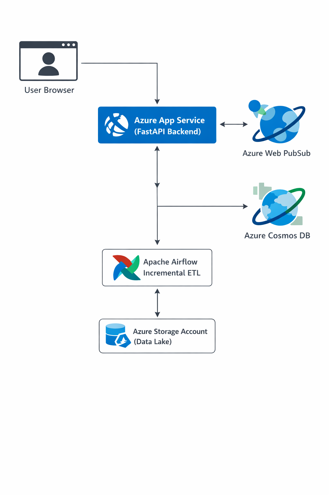

# Azure Real-Time Chat Platform with Incremental Data Pipeline

## Overview

This project implements a production-grade real-time chat system on Azure with an incremental ETL pipeline orchestrated using Apache Airflow and Infrastructure-as-Code using Terraform.

## Architecture
				
## Features

* Real-time chat using Azure Web PubSub
* Backend deployed on Azure App Service
* Cosmos DB as distributed NoSQL database
* Incremental ETL pipeline using Apache Airflow
* Data exported to Azure Storage Account
* Infrastructure managed using Terraform
* Browser-based UI hosted within FastAPI

## Tech Stack

* Python, FastAPI
* Azure Cosmos DB
* Azure Web PubSub
* Azure App Service
* Apache Airflow
* Azure Storage Account
* Terraform

## Incremental Pipeline Design

Airflow DAG extracts only new messages using timestamp-based incremental logic and stores them in Azure Storage.

## Author

Pranav Jain
